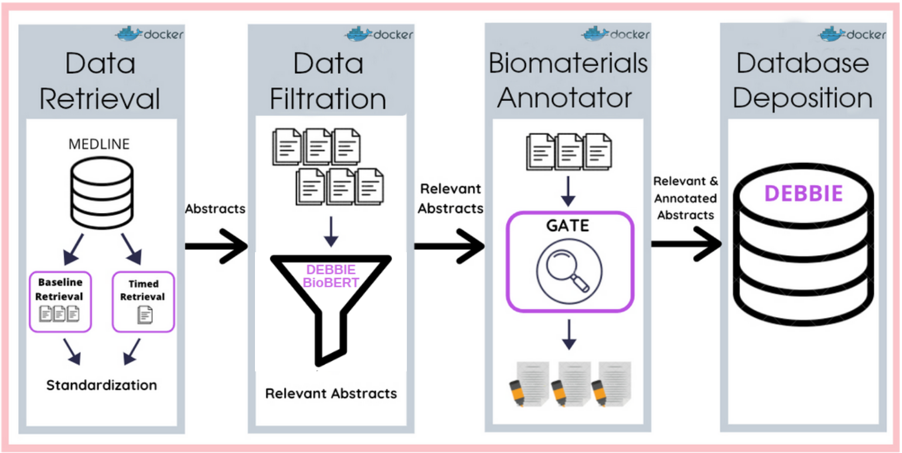

# debbie-pipeline 

The debbie automated pipeline retrieves biomaterials abstracts from PubMed, annotates them using multiple lexical assets (and in particular DEB (The Device, Experimental scaffolds and medical Device ontology) and MESH, and deposits the annotated abstracts in a NoSQL database. The database search page is: debbie.bsc.es/search/. 

## Description 

The pipeline orchestrates the execution of the following components (some of them are in separate GitHub repositories):
1. Periodic abstract retrieval from PubMed
2. Standardization of the abstract text
3. Binary classification (relevant/Non-relevant to biomaterials) using an SVM implementation
4. Gate-based annotation of the relevant abstracts with terms from the DEB ontology, UNLS semantic types and other manually-selected classes from open ontologies (eg. NPO, NCIT, UBERON) 
5. Conversion of the resulting gate files to .json and their deposition in the DEBBIE Mongo database

## Pipeline overview 

## To run the pipeline.  

Open the run.sh file and configure the corresponding parameters when needed.
Then to run the pipeline simple execute **bash run.sh**

## Built With

* [Docker](https://www.docker.com/) - Docker Containers
* [Maven](https://maven.apache.org/) - Dependency Management

## Versioning

We use [SemVer](http://semver.org/) for versioning. For the versions available, see the [tags on this repository](https://github.com/ProjectDebbie/DEBBIE_pipeline/tags). 

## Authors

* **Javier Corvi** - **Austin McKitrick** - **Osnat Hakimi**

## License

This project is licensed under the GNU GENERAL PUBLIC LICENSE Version 3 - see the [LICENSE](LICENSE) file for details

## Citing
 * Corvi, J., McKitrick, A., Fernández, J., Fuenteslópez, C., Gelpi, J., Ginebra, M.-P., Capella-Guitierrez, S., Hakimi, O. DEBBIE: the open access database of experimental scaffolds and biomaterials with an automated information retrieval pipeline. Manuscript in preparation (2022).

* Corvi, J., Fuenteslópez, C., Fernández, J., Gelpi, J., Ginebra, M.-P., Capella-Guitierrez, S., Hakimi, O. The biomaterials annotator: a systemfor ontology-based concept annotation of biomaterials text. In:Proceedings of the Second Workshop on Scholarly DocumentProcessing, pp. 36–48. Association for Computational Linguistics,Online (2021). https://www.aclweb.org/anthology/2021.sdp-1.5

* Hakimi, O., Gelpi, J., Krallinger, M., Curi, F., Repchevsky, D., Ginebra, M.-P. The devices, experimental scaffolds, and biomaterials ontology (deb): A tool for mapping, annotation, and analysis of biomaterials’ data. Adv. Funct. Mater. (2020)

## Funding
 This project has received funding from the European Union’s Horizon 2020 research and innovation programme under the Marie Sklodowska-Curie grant agreement No 751277

	
		
